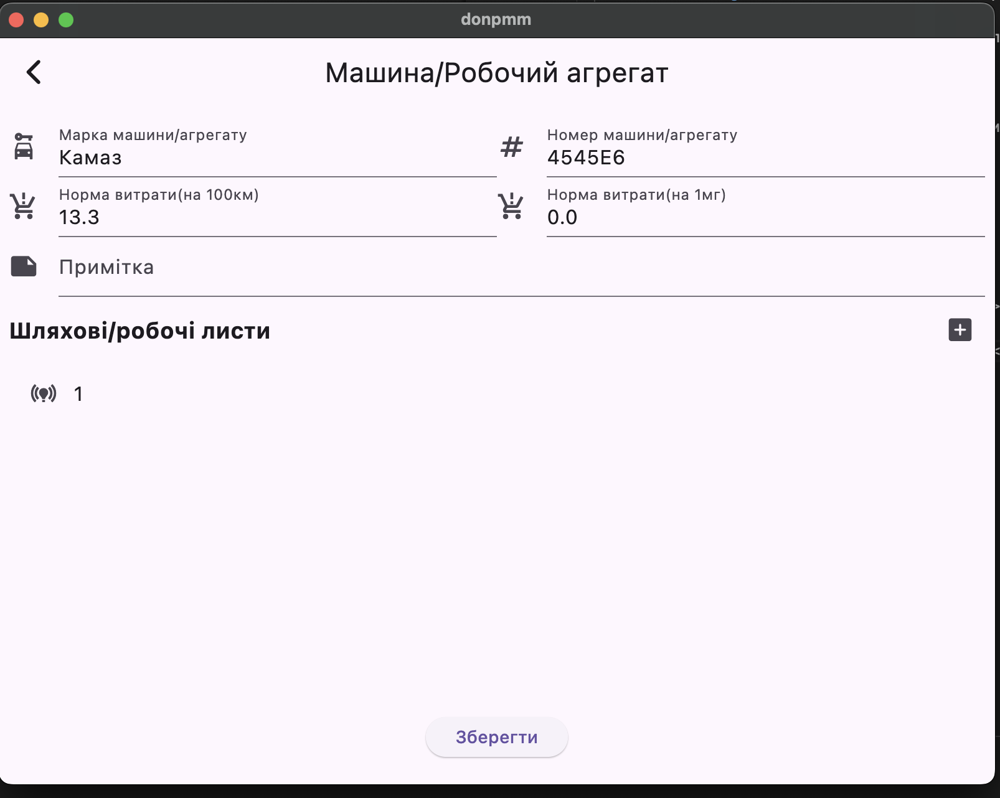
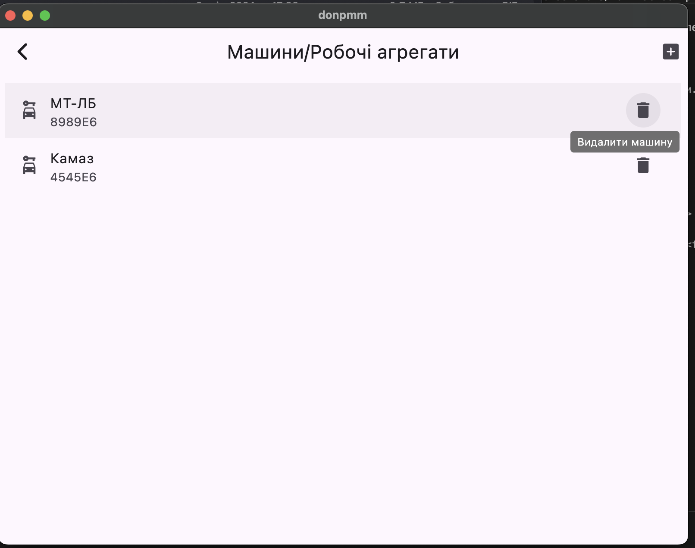

Використання
============

Загальний приклад використання можна переглянути на :doc:`Приклад використання <happy-flow>`

.. _car_add:

Додавання машини
----------------
Для формування донесення вам потрібно додати наявні машини та робочі агрегати.

.. _car_remove:

Видалення машини
----------------
Щоб видалити машину, натисніть на іконку зображену на картинці нижче.

.. _waybill_add:

Додавання шляхового листа
-------------------------

.. _waybill_aggregate_add:

Додавання листа агрегату
------------------------

.. _save_report:

Збереження донесення
--------------------

.. _load_report:

Завантаження донесення
----------------------

.. _new_report_from_current:

Створення нового донесення з поточного
--------------------------------------