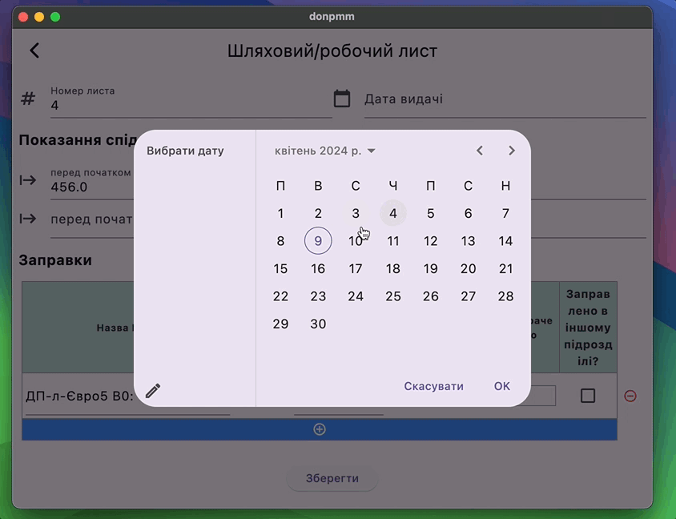
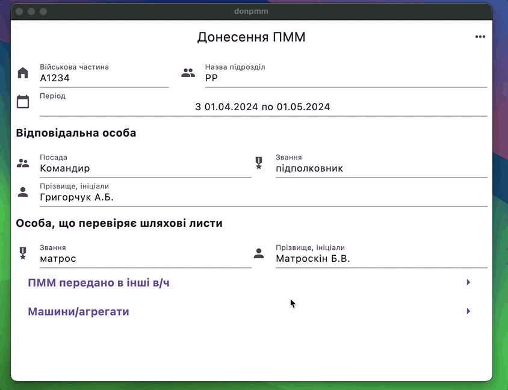
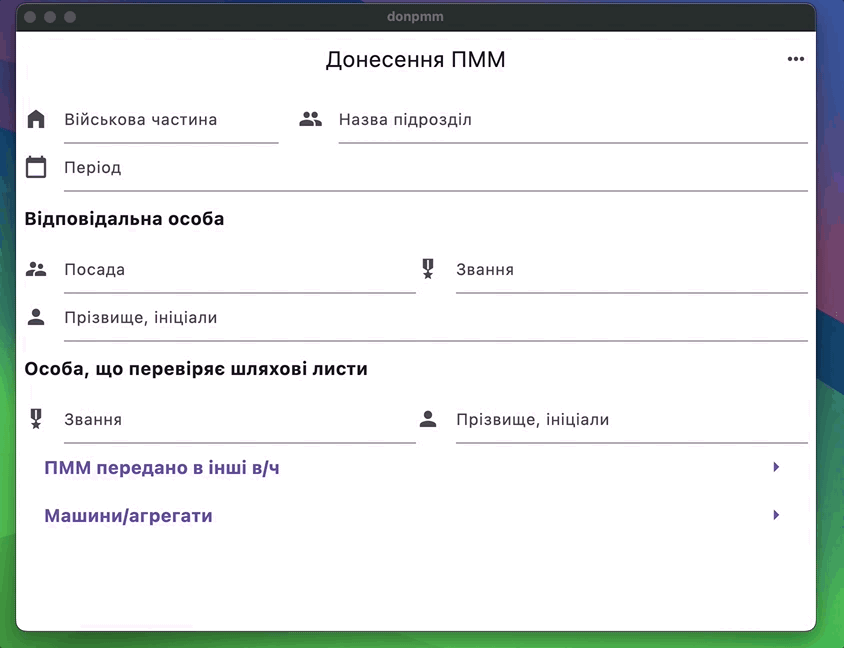

Використання
============

Загальний приклад використання можна переглянути на :doc:`Приклад використання <happy-flow>`

.. _car_add:

Додавання машини
----------------
Для формування донесення вам потрібно додати наявні машини та робочі агрегати.

.. image:: screenshots/car-edit.png

.. _car_remove:

Видалення машини
----------------
Щоб видалити машину, натисніть на іконку зображену на картинці нижче.

.. image:: screenshots/car-delete.png

.. _waybill_add:

Додавання шляхового листа
-------------------------
При додаванні нового шляхового листа залишки пмм переносяться з попередніх листів.

.. _waybill_aggregate_add:

Додавання листа агрегату
------------------------

Лист агрегату додається так само як і шляховий лист. В листі агрегату не вказуюється кілометраж. Замість кілометражу потрібно вказати кількість мотогодин.

.. _save_report:

Збереження донесення
--------------------

Виберіть в головному меню пункт `Зберегти` і вкажіть назву файлу.

.. _load_report:

Завантаження донесення
----------------------

Виберіть в головному меню пункт `Відкрити` і виберіть файл з донесенням. Донесення можна відкрити, тільки те, що створене за допомогою програми.

.. _new_report_from_current:

Створення нового донесення з поточного
--------------------------------------